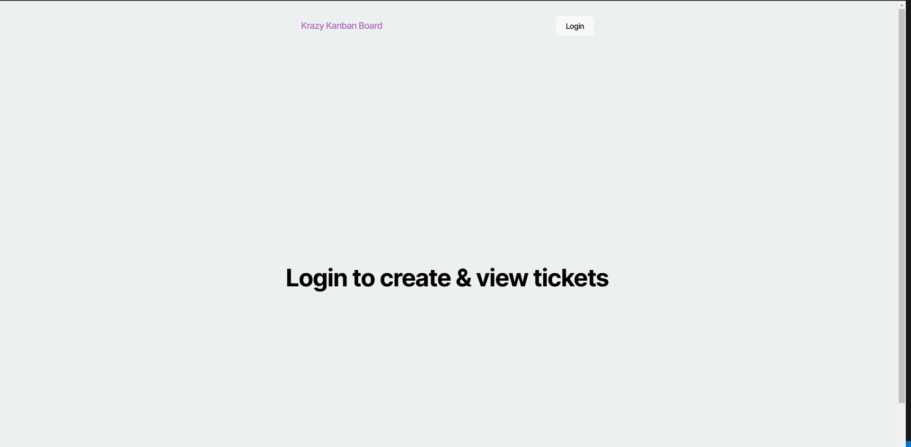
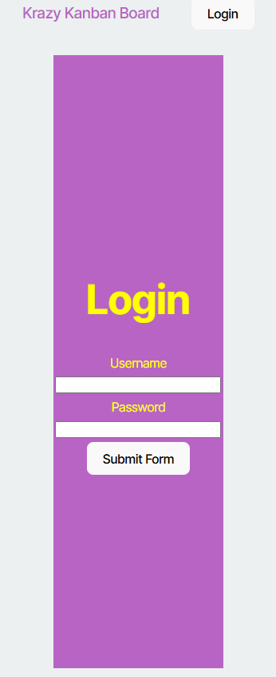

# Kanban Board

## Description: 
Kaban board application. Allows the user to log in with username and password and add authentication with JSON Web Tokens (JWTS) to the server API.    

## user Story:
As a member of an agile team I want a Kanban board with a secure login page.
The page needs to have, inputs for username and password, able to authenticate using JSON Web Tokens (JWT) and redirected to the main Kanban board page

## Installation: 
To run the website from your terminal. Fill out the information in your .env file. 
Then run; npm run start:dev. 

  

  

## Web App Link

## License
MIT License

